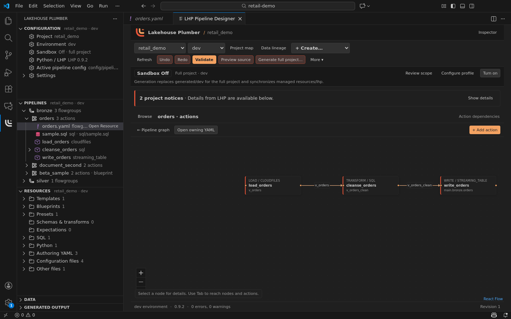
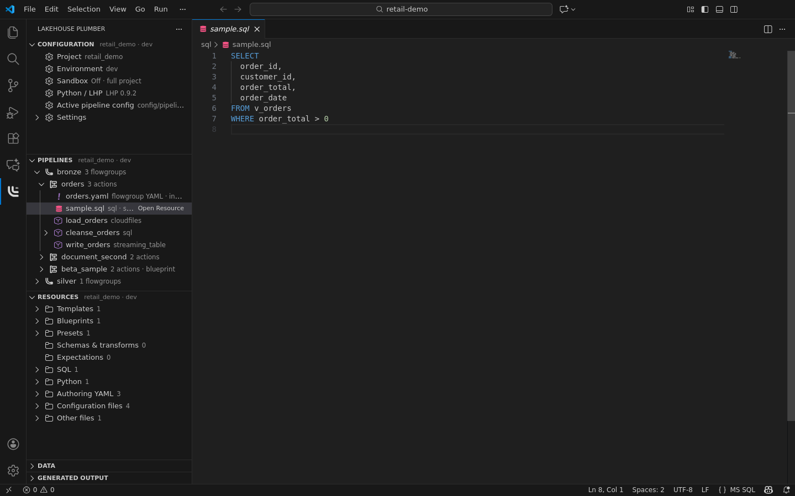
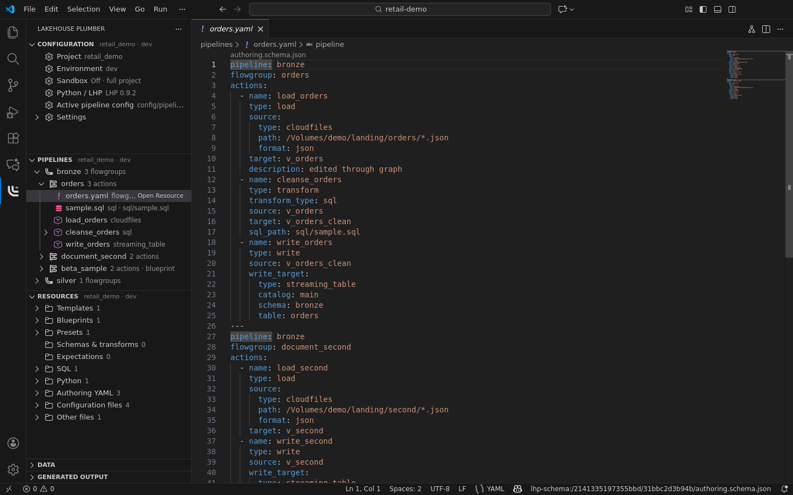
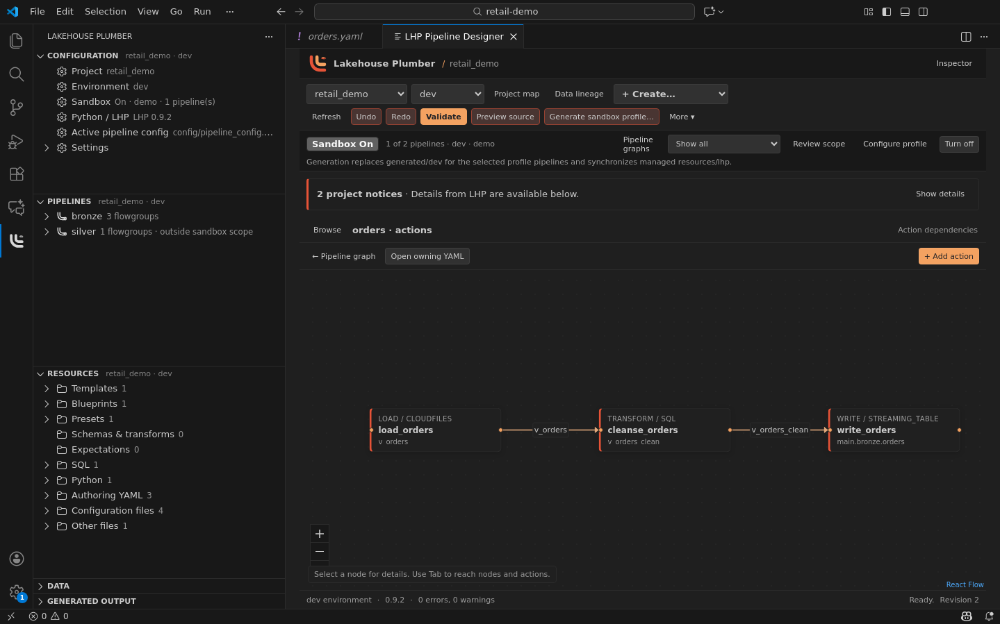

# Lakehouse Plumber for VS Code

Author Lakehouse Plumber pipelines with native YAML, source-linked sidebar views and a graph designer that edits those same VS Code documents. Forms participate in your editor's undo history; there is no second project store.

Version 0.3.1 is a desktop **pre-release** for local folders on macOS, Windows and Linux under `MEHDIMODARRESSI.lhp-vscode`. It requires VS Code 1.106 or newer, Python 3.11+ and a compatible local LHP installation; neither Python nor LHP is bundled. [YAML by Red Hat](https://marketplace.visualstudio.com/items?itemName=redhat.vscode-yaml) is an extension dependency.



The Pipelines view opens flowgroups and actions in the designer. The graph comes from LHP dependency analysis; the source files remain authoritative.

## Get started

1. If you installed the earlier VSIX under `Mmodarre.lhp-vscode`, uninstall that old extension ID first. Your LHP project files are unaffected. Extension-local project, interpreter, environment, sandbox and view selections may need to be chosen again; review them in **Configuration**. A workspace `lhp.pythonPath` setting remains in the workspace file.
2. In VS Code Extensions, search for `@id:MEHDIMODARRESSI.lhp-vscode` and choose **Install Pre-Release Version** when the listing is available. Until then, use the [versioned GitHub pre-release VSIX](https://github.com/Mmodarre/lhp-vscode/releases) with **Extensions: Install from VSIX…**. VS Code may prompt to install the Red Hat YAML dependency.
3. Open a local folder containing `lhp.yaml`, or run **LHP: Create Project**. Choose the **Lakehouse Plumber** Activity Bar icon. Contained source browsing works without Python; Python execution and edits require workspace trust.
4. Use **LHP: Select Python Interpreter** for an existing compatible environment, or **LHP: Set Up Python Environment** to create one with Python 3.11+. For a new environment, choose **Recommended reviewed LHP integration build**. Then open **LHP: Open Pipeline Designer**, validate, preview source and confirm **Generate Project** when ready.

In Restricted Mode, **Create Project**, **Select Python Interpreter** and **Set Up Python Environment** offer **Manage Workspace Trust**. Review the folder and grant trust only if you trust its contents, then run the LHP command again. Opening the trust editor or dismissing the prompt ends the current command without running Python or writing project files.

Sandbox features require the reviewed public LHP core commit [`4a53d72a96c386a12ff237fc0105a31266007f39`](https://github.com/Mmodarre/Lakehouse_Plumber/commit/4a53d72a96c386a12ff237fc0105a31266007f39). This Git integration build is **not yet a released LHP package** and still reports distribution version `0.9.2`. The extension checks its `sandbox_editor` capability rather than inferring support from that version label. Earlier compatible editor builds can continue ordinary authoring with Sandbox Off, but Sandbox On requires the reviewed build or an equivalent compatible local source/wheel. The recommended setup uses Git and network access to install the pinned commit into the chosen isolated environment.

To upgrade an existing project `.venv`, run **LHP: Set Up Python Environment** → **Install or repair LHP in this environment** → **Recommended reviewed LHP integration build**. This explicit repair reinstalls the pinned Git commit even when an older core has the same `0.9.2` package version, and checks `sandbox_editor` before reporting success. Choose **Create an environment in another folder** if you want to leave the existing environment untouched.

[Read the user guide](docs/USER_GUIDE.md) for the first-pipeline and existing-project workflows, or [get support](SUPPORT.md).

## Authoring

- Use five native views: **Configuration**, **Pipelines**, **Resources**, **Data** and **Generated Output**. The Activity Bar uses the exact monochrome LHP mark and the designer header uses its full-colour mark; neither changes your VS Code theme. Select one project; expand only the resources you need. Pipeline and flowgroup clicks open their graphs, while action and file clicks open native source.
- Browse physical resources even with invalid YAML or an unavailable runtime. Find resource paths and known consumers without launching Python.
- Explore canonical pipeline dependencies and on-demand table/sink lineage. Inspect template drafts, saved pipeline/job settings, effective presets and local substitutions in expiring read-only documents.
- Add, configure, duplicate and delete actions. Connect or disconnect directly declared dataset inputs; code-derived edges open their SQL/Python source for editing.
- Edit YAML beside guided forms. Changes use version-checked WorkspaceEdits, preserve unchanged mapping comments, and participate in native undo/redo.
- Create an empty project or TPC-H sample, a first flowgroup, files-to-bronze ingestion and template/blueprint instances. Shared definitions and generated monitoring actions show their actual editing scope.
- Open referenced SQL, Python, schemas, expectations and configuration in native editors.
- Use runtime-matched YAML schemas, context-aware reference/parameter/file/token suggestions, catalogue-derived action snippets, hover help, definitions and a version-checked path quick fix. Red Hat YAML supplies syntax/schema support; LHP adds cached project context without Python calls on each keystroke.
- Use view-title and context-menu shortcuts for refresh, validation, preview, generation, environment and Python setup. Existing LHP commands can also be assigned your own keyboard shortcuts in VS Code.
- Select project, interpreter and environment independently, including nested projects in one workspace.
- Validate drafts, preview generated source as read-only native documents, and explicitly generate either the full saved project or the active saved sandbox profile.
- Browse persisted source, wheels and bundle artifacts; compare eligible current-environment generated source with an expiring draft preview. Successful source generation records exact flowgroup authoring links.
- Open the Databricks bundle and hand off deployment to the official Databricks extension.



Physical YAML, SQL and Python files appear under each flowgroup that uses them. Shared files can show known consumers across the whole authored project, including pipelines outside a sandbox display.



The YAML document remains the source of truth for graph and form edits; VS Code handles its normal file editing, save and undo behavior.

Open **Configuration → Sandbox** to turn sandbox mode on and configure the native `.lhp/profile.yaml` file. The profile contains a namespace and exact, case-sensitive pipeline names or globs. The extension starts with Sandbox Off. When On, the Pipelines view and designer show the selected scope by default; **Show all** changes only what is displayed and marks pipelines outside scope. A file shared with a hidden pipeline still shows its known project-wide uses. An invalid or missing profile blocks sandbox preview/generation until fixed. A valid unsaved profile draft can be validated and source-previewed, but must be saved before generation.



Preview is a source rendering aid, including sandbox namespace rewrites for source-mode files when Sandbox is On. It does not represent bundle synchronisation, monitoring finalisation or wheel packaging. It runs against an isolated project mirror and includes supported unsaved source documents. A preview expires when source, sandbox scope, environment or interpreter changes.

Large refreshes remain cancellable and retain their previous graph with an explicit loading or failure state. The 0.3.0 runtime was checked against the public performance example with 4,017 flowgroups and 18,766 actions, preserving every canonical action and dependency. Its measured native refresh took 22.357 seconds in a shared Linux ARM64 environment, not a fixed latency guarantee or a measurement of 0.3.1. The Python bridge retains a fixed 32 MiB decoded-response budget; an over-budget response fails explicitly without dropping graph members. External dataset notices are collapsed by default and graph rendering is limited to the visible viewport. In large projects (over 500 flowgroups), edits update physical resources and mark the semantic graph stale; refresh that graph explicitly when ready. Physical discovery has a disclosed 50,000-entry budget, YAML classification a 512 KiB-per-file budget, and custom YAML assistance a 2 MiB-per-document budget. Read-only Data inspection uses a separate authoring-file mirror limited to 50,000 files/256 MiB; it does not append source bodies to the graph snapshot.

**Generate Project** asks for one explicit confirmation and saves project documents first. Both modes replace `generated/<environment>` and synchronise managed `resources/lhp`; Sandbox On emits only the profile-selected pipelines, while Off emits the full project. There is no separate namespace output folder, and Show all does not change the write scope. Cancellation stops the process tree; generation itself is not transactional, so cancelled output should be regenerated before use. Configured test actions are always validated; emitting their generated hooks in preview/generation is controlled by `lhp.includeTestsInGeneration`, matching the CLI's opt-in flag.

No remote execution, Databricks credentials, telemetry service, embedded editor or separate form save store is included. Workspace trust is required for Python execution and edits. Existing VS Code YAML functionality remains provided by Red Hat.

## Develop and verify

Use Node.js 22.12+ and Python 3.11+. Install the pinned core build into an isolated Python environment, then set `LHP_TEST_PYTHON` to its executable.

```sh
npm ci
npm run typecheck
npm run lint
npm run format:check
npm run build
npm test
npm run test:bridge
npm run test:extension
npm run test:release
npm run audit:production
npm run package
```

On headless Linux, use `xvfb-run -a npm run test:extension`. The runner downloads VS Code 1.106.0 and the official Red Hat YAML 1.24.0 release VSIX with a pinned SHA256, then uses isolated test settings and extensions. It never touches your installed VS Code profile. Real adapter tests require `LHP_TEST_PYTHON`; CI fails if it is missing or incompatible. Existing core E2E fixtures and baselines are not modified.

The [verification record](TODO.md) distinguishes tested runtime revisions, native UI checks, three-platform CI and audited artifacts from the pending Marketplace upload. The [release guide](docs/marketplace-release.md) covers first manual publication and later release preparation.

`npm run package` creates `.tmp/lhp-vscode-0.3.1.vsix` from a clean source revision and audits its contents. Only bundled host/webview JavaScript, CSS, the Python adapter, runtime media, README, changelog, support, licence and notices belong in the VSIX. The screenshots are source-hosted and not runtime assets. Python/LHP itself is installed separately. Development dependencies, tests, project files and local paths must not be shipped.

See [PLAN.md](PLAN.md), [TODO.md](TODO.md), [architecture](docs/ARCHITECTURE.md) and [research](docs/RESEARCH.md). Apache-2.0; upstream and bundled dependency notices are retained.
