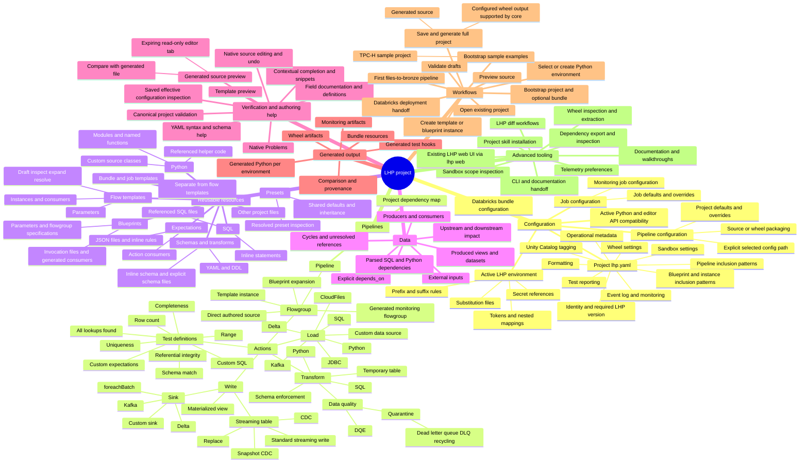

# LHP 0.2.0 approved sidebar and authoring design

**Status: approved by the user on 8 October 2026. Implementation is authorised; progress and acceptance evidence are tracked in PLAN.md and TODO.md.**

Prepared on 8 October 2026 against extension commit `77424fdda947d53ff60177a2b5b0f823be98161c` and the compatible LHP editor API at `98d285ab8a7606867abb5708f2715ebe31a9befc`. Application code, core code, tests and packages were not changed for this proposal. All example names below are synthetic.

## 1. Agreed direction and design objective

The user selected **one active project, separate sidebar sections, and the native appearance of the official Databricks VS Code extension**, with the supplied **dbt VS Code screenshot as additional layout inspiration** and the **existing LHP website palette** for LHP branding. The redesign uses native VS Code views, standard typography, spacing, disclosure controls, theme colours, contextual actions and keyboard behaviour. It does not imitate Databricks or dbt branding or introduce a custom dashboard inside the sidebar. Native selection, focus, diagnostic and contrast colours remain controlled by the user's VS Code theme.

Review this document together with the [interactive design mockup](https://p.superdesign.dev/draft/aaec4012-3458-43ae-9309-d18d49b7fce1) and [design canvas](https://superdesign.dev/teams/f33bcfc4-6374-42ff-ab64-c439e1720bd4/projects/486ec816-2286-479c-8d31-746d948f8af8?node=draft-variant-aaec4012-3458-43ae-9309-d18d49b7fce1). These are design artifacts, not a running extension or evidence of implemented features.

The rejected sidebar represented only the resolved pipeline graph. The replacement must make the whole LHP project discoverable: configuration, reusable definitions, environments, supporting code, schemas, quality rules, data dependencies and generated artifacts. Native source remains authoritative; the graph and guided forms are additional ways to understand and edit it.

There are exactly five views, in this order:

1. **Configuration**
2. **Pipelines**
3. **Resources**
4. **Data**
5. **Generated Output**

Configuration, Pipelines and Resources start expanded, with their contents shallow. Data and Generated Output start collapsed. Expansion, selected items and filters are remembered per project. Help remains available through commands, contextual help and a walkthrough, not a sixth permanent view.

The Activity Bar uses the **existing exact `lhp-mark-mono-light.svg` / `lhp-mark-mono-dark.svg` geometry**, which matches the supplied LHP logo PNG. The current generic cube is rejected. This proposal includes the existing mark's placement and appearance for approval; it does not propose another adaptation or a separate identity approval process. Implementation acceptance will verify its native-size legibility and contrast in light, dark and high-contrast themes. The extension's larger colour icon and native Activity Bar mask remain distinct uses of the same identity.

### LHP palette and native theme ownership

Use the palette verified in the LHP website's actual stylesheet and design-system source. [B1]

| Existing LHP colour | Value | Intended use in this design |
|---|---|---|
| Vermilion | `#E65337` | Existing full-colour mark and restrained LHP-owned accents |
| Apricot | `#F4A261` | LHP-owned graph/control emphasis, paired with readable charcoal text |
| Charcoal | `#202126` | LHP-owned dark surfaces/text where contrast is appropriate |
| Warm white | `#FAF8F5` | LHP-owned light surfaces where compatible with the active theme |
| Soft apricot | `#FCEBDE` | Subtle branded supporting surfaces in custom UI |
| Stone | `#EEECE7` | Neutral supporting surfaces in custom UI |
| Black / white | `#000000` / `#FFFFFF` | Existing palette neutrals and contrast |

`#B83F2B` remains a detail in the existing logo artwork, not a new general UI token. The designer header uses the exact full-colour LHP logo; custom graph nodes, edges and extension-owned control accents can use the palette. Prefer readable charcoal/apricot combinations and verify actual contrast, rather than using orange for all text. The native Activity Bar, TreeView font, focus ring, selection and diagnostic colours remain VS Code-owned. The mockup's neutral charcoal host theme illustrates one theme and does not propose changing user settings. Do not import the website's Cabinet/Satoshi fonts or its neo-brutalist geometry into the developer UI.

### What the supplied dbt reference contributes

The user-provided canvas image shows a native Activity Bar and roughly 360-pixel sidebar, a Get Started walkthrough card, clearly grouped extension information/status, configuration values with actions, operation commands and accessible help. It sits beside a native SQL editor with bottom-panel Terminal, Lineage and Problems. This is evidence about the supplied visual reference, not a claim about the current official dbt extension version or its entitlement model. [B2]

Borrow its clear hierarchy, visible current state, configuration actions and easy-to-find help. Keep LHP's five daily-use views rather than copying dbt's registration status, profiles/deferral concepts, remote commands or orange/purple branding. For a new project or incomplete setup, expose stronger **Get Started** guidance through native welcome content and a walkthrough, with accessible **Help / Get Started** title or overflow actions. A healthy configured project does not retain a large onboarding card that pushes its resources offscreen. The ordinary native editor and bottom panels remain available beside the designer.

## 2. Complete LHP feature brain map

This map covers the product model, including features which are not currently exposed by the extension. It is not a list of buttons promised for immediate implementation.



The action families and subtypes come from core enums and write-target handling; project switches come from the project configuration model. Configuration and Resources already have separate navigation in the existing LHP web GUI. TPC-H is the bootstrap API's sample mode. [C1], [C2], [C3], [C9]

## 3. Native five-view wireframe

The following is a content and interaction wireframe, not a pixel-perfect rendering. `[gear]`, `[+]`, search and overflow represent native title or item actions. They are not literal text buttons to be drawn into tree rows.

```text
ACTIVITY BAR                 LHP
[approved LHP mark]

  v CONFIGURATION                          [overflow]
      Project          Retail Demo             [gear]
      Environment      dev                     [gear]
      Python / LHP     3.11 · compatible       [gear]
      Active pipeline config   pipeline_config.yaml [gear]
    > Settings

  v PIPELINES                       [search] [+] [overflow]
      Project map                    3 pipelines
    > bronze_ingestion               8 flowgroups
    > silver_transform               6 flowgroups
    > gold_serving                   3 flowgroups

  v RESOURCES                              [+] [overflow]
    > Templates                              4
    > Blueprints                             2
    > Presets                                5
    > Schemas & transforms                   7
    > Expectations                           3
    > SQL                                   12
    > Python                                 4

  > DATA

  > GENERATED OUTPUT
```

Counts are shown only when known. An unavailable or not-yet-loaded catalogue is not represented as zero resources. Long labels retain their full name and project-relative path in a tooltip; nested paths disambiguate duplicate names. Source/provenance badges are concise and meaningful, not a second row of explanatory prose.

### Configuration

- **Project** represents the active project. Its gear opens a project picker; switching does not merge data from different roots. The row's context menu offers native source/root navigation.
- **Environment** shows the active LHP environment, not a Databricks workspace target. Its gear changes the environment. Opening the environment source and changing the active environment are separate actions.
- **Python / LHP** shows selected interpreter and compatibility state. Its gear opens interpreter selection/setup. Full executable path, Python version, LHP version and capability failure appear in details or a tooltip, not as a wide permanent error banner.
- **Active pipeline config** opens the actual selected pipeline configuration; its gear selects or clears that setting. The design must not assume that a file named `config/pipeline_config.yaml` is active. An unset value says **Not selected** rather than implying that the conventional file is applied.
- **Settings** is the fifth row and starts collapsed. It contains `lhp.yaml`, environment/substitution files, job settings, bundle configuration/templates, monitoring settings and sandbox/advanced project settings. These are native source/settings links, not extra permanent top-level rows. Monitoring-job and ordinary job configuration remain distinguishable.
- A setting which does not exist remains distinguishable from one that exists but is inactive. A proposed create/enable action must explain its file changes before applying them.

The project, environment and Python rows represent real configuration values. Do not add a tree of fake command-button rows such as “Validate”, “Generate” and “Install”. Operations belong in title/context actions, commands and onboarding.

### Pipelines

- Pipeline rows expand to flowgroups, then actions. Rows are created lazily; collapsed flowgroups do not instantiate every action.
- **Project map** is the project-wide dependency object. Its graph is a proposed addition: the core supplies a pipeline graph, but the current bridge does not send it.
- Clicking a **pipeline** opens its flowgroup graph; clicking a **flowgroup** opens its action graph. Clicking an **action** opens its exact native YAML source. **Open Source** remains an explicit adjacent/context action on flowgroups; **Open in Designer** on an action selects its graph and inspector.
- A pipeline is a logical group, not necessarily a dedicated file. Its source choices are its flowgroups; no fictional pipeline source file is created. Native disclosure controls expand/collapse the tree independently of the primary navigation action.
- Direct, template-derived, blueprint-derived and generated monitoring entities retain different provenance. Expanded inherited actions are not presented as private editable copies.
- `[+]` offers relevant creation paths: first flowgroup, files-to-bronze, template instance or blueprint instance. A “new pipeline” guide creates an initial flowgroup with that pipeline name, not an empty fictitious pipeline file.

### Resources

- The seven top-level categories stay visible and shallow. Deeper folder structure is revealed only when useful for disambiguation.
- Leaf clicks open native files. Context actions include source-appropriate operations such as **Create instance**, **Find consumers**, **Reveal in Explorer** and, where supported, **Inspect resolved configuration** or **Preview template**.
- Paths come from canonical catalogue entries or an explicit file/reference inventory, never “first matching basename”. Display names and filenames are not interchangeable.
- `templates/bundle/job_config.yaml` is a **bundle/job configuration template**, not an LHP reusable flow template. It belongs under Configuration → Settings → Bundle/job templates. Apply the same distinction to other bundle templates.
- `schemas/`, `expectations/`, `sql/`, `python/` and `schema_transforms/` are useful conventions, not exclusive discovery rules. Explicit `schema_file`, `expectations_file`, `sql_path`, `module_path` and related declarations can identify files elsewhere inside the project. Preserve a **Find LHP Resource / Reveal in Explorer** fallback for all contained files.
- Inline SQL, schemas and expectations remain attached to their owning action; the UI must not invent standalone files for them.

### Data

- This is an environment-aware view of declared/resolved datasets, with producers, consumers, external inputs and dependency/impact navigation.
- It is not a live Databricks catalogue, table browser or row-preview service. No row counts, live schema, data samples or remote test results are implied.
- Clicking a dataset opens a useful lineage/details view; **Go to producer** and **Go to consumer** navigate to the owning source action.
- External datasets have no local source file. Show their identity and consumers; never create or guess a YAML source location.

### Generated Output

- This view contains **persisted generated files on disk only**, grouped by environment and actual kind/path. A preview is not a permanent Output tree entry.
- Draft preview opens a separate read-only editor tab, tied to a source revision/environment/runtime and explicitly marked expired when invalidated. It belongs to the verification workflow; a **Compare with generated file** action can connect it to persisted output without merging their lifetimes.
- Generated Python, test hooks, monitoring artifacts, wheel artifacts and `resources/lhp/` bundle resources are distinct artifact types. Only actual existing artifacts are shown as files.
- Generated artifacts do not have an editable action source of their own. **Go to authoring source** appears only where a verified relationship exists. Monitoring output can point to its project configuration; unsupported mappings say so.
- Clicking generated source opens it for inspection with generated provenance clear. The sidebar does not provide a misleading form to edit generated output as source. Native filesystem permissions remain separate from a read-only preview provider.
- **Compare preview with generated file** is a proposed native diff action, not a claim of bidirectional compiler line mapping or complete parity with the LHP CLI diff command.

## 4. Capability coverage and honest gaps

**Current** describes the extension as reviewed. **Core-supported** means a public API or core source capability exists; it does not mean the extension already exposes it. **Proposed/gap** describes work requiring approval.

| Capability | Current extension | Core support / source | Proposed treatment and remaining gap |
|---|---|---|---|
| Project discovery/context | Finds nested `lhp.yaml` roots; per-project interpreter/environment; folder-name labels; discovery cap 200 | `ProjectConfigView`, project include fields | Selected project in Configuration; meaningful project name with path identity; disclose discovery limits; no eager scan of every root |
| Full project map | Individual pipeline/flowgroup graphs only | `analyze_dependencies(include_graphs=True)` includes pipeline graph | Add project map through a bounded bridge projection; current projection omits it |
| Pipelines/flowgroups/actions | Graphs, native sources, direct action add/configure/duplicate/delete/connect/disconnect | `inspect_editor_project`, action catalogue, canonical graphs | Keep full hierarchy and source scopes; add search and contextual creation without implying arbitrary code-edge rewrites |
| Load/transform/write varieties | Catalogue-driven action forms plus complete mapping fallback | 7 load, 5 transform, 3 write subtypes [C2] | All remain discoverable through Add action and native YAML; do not hard-code a reduced sidebar-only subset |
| Flow templates | Instance creation, parameter fields, definition links | `editor_catalog`, `template_catalog`, `template_source`, `preview_template` | Standalone Templates category, consumers and proposed bounded draft preview; malformed definitions must remain repairable |
| Blueprints/instances | Instance guide, invocation parameter editing, provenance links | Blueprint catalogue, configurable discovery globs, scaffold API | Browse definitions and invocation files separately; shared edits state their consumer impact |
| Presets | Catalogue, name completion and definition navigation | `list_presets`, `resolve_preset` | Presets browse/inspect; contextual application and safe consumer indexing need new work |
| Environments/substitutions | Active environment picker; known-file schema association | `build_substitution_view(env)`; `substitutions/<env>.yaml` | Edit/select independently; token inspection is proposed; secret-reference completeness is not guaranteed by the current view API |
| Project settings | Native YAML and schema help | `lhp.yaml`: includes, metadata, event log, monitoring, tests, tagging, wheel, sandbox, formatting | Configuration links and optional focused editors; bridge currently discards project metadata/feature flags |
| Pipeline settings | Explicit selected path; new bundle project creates/selects active config | `preview_configuration(kind='pipeline', ...)` | Open the actual selected config; proposed effective-settings inspection must say saved-only |
| Job/monitoring settings | Native files; known job schema association | Job and monitoring-job config; saved configuration preview | Direct entries and clear normal/monitoring distinction; full structured editing is not implemented |
| Bundle/job templates | Can be opened as files, but not distinguished by native sidebar | Project bundle-template assets such as `templates/bundle/job_config.yaml` | Group with configuration templates; never classify merely by `templates/` prefix as a flow template |
| Schemas/DDL/schema transforms | Action-linked source opening and schema action forms | Inline or explicit `schema_file`; schema enforcement | Resource inventory and consumer links; folder conventions alone are insufficient |
| Expectations/DQE/quarantine | Data-quality action forms and referenced-file opening | `expectations_file`, inline expectations, DQE/quarantine modes | Expectations category and ownership links; no unimplemented dedicated rule designer claimed |
| SQL | Native referenced source and canonical parsed dependencies | `sql`, `sql_path` and source/write path fields | Complete SQL resource browse plus consumers; inline SQL remains YAML-owned |
| Python/functions/custom sources | Native module links and action configuration | `module_path`, `function_name`, custom-source classes and declared helper paths | Python resources; exact function navigation requires reliable symbol indexing, not guessed import paths |
| Tests | Nine test-action definitions, canonical validation, optional generated hooks | Test model and test-reporting config | Test-definition filter/details; no local data-test execution or false “Run tests” result |
| Tables/datasets/impact | Graph edges and external-source notices | `build_dataset_index`, dependency graphs | Data view with producers/consumers; requires bounded index projection; no live warehouse queries |
| Validation | Canonical draft validation and native Problems | `validate_editor_project` | Reuse Problems and show concise current operation state; avoid a second diagnostic store |
| Draft source preview | Isolated mirror; read-only expiring native preview documents | `preview_editor_project` | Verification action opens a separate expiring editor tab, with proposed comparison to disk output; no permanent Generated Output entry |
| Full generation | One save/scope confirmation; full saved project; environment output replacement | `generate_pipelines` with explicit output and no pipeline filter | Preserve full-project scope in every entry point, even when invoked from a selected pipeline |
| Persisted outputs | Written by generation, no dedicated inventory view | `generated/<env>/`, actual generated artifacts | Generated Output inventory and verified source relationships; no invented line-level source map |
| Bundle handoff | Opens `databricks.yml`; hands off to official extension | Public bundle enable/sync/local validation APIs | Browse definition/resources; new local bundle actions need scoped mutation design; no deploy/run/auth implementation |
| Wheel tooling | Wheel preview unsupported; no inspect/extract UI | Public wheel list/extract support; packaging in core configuration | Show/edit config and existing artifacts; dedicated editor workflow absent/unverified; no unqualified wheel execution promise |
| Sandbox | No extension execution control | Sandbox scope/configuration and core generation semantics | Browse/edit configuration; scope inspection may be proposed later; execution stays outside this redesign |
| Filtered generation | Deliberately absent | Core generation filtering exists, but commit replaces environment output | Do not add “Generate this pipeline” until destructive scope is independently solved |
| Diff/export/skills/telemetry utilities | Not exposed as sidebar workflows | CLI utilities and relevant public dependency/skill APIs | Help/Advanced command discovery; evaluate each public API and side effect before proposing execution |
| Onboarding | Python selection/setup, project bootstrap, bronze/template/blueprint guides | Bootstrap and scaffold APIs | Contextual empty states and `[+]` entry points; no permanent wall of setup buttons |
| Sample projects, docs and web UI | Walkthrough and user guide exist; bootstrap currently passes `sample_mode=False`; no web-server launch control | Bootstrap sample mode; installed CLI `web`, `skill`, telemetry and documentation surfaces | Help command/walkthrough links and an explicitly proposed sample-project guide; do not add a sixth view or silently launch a server/install a skill/change telemetry |
| YAML help | Red Hat schemas; basic value completion, hover, definitions; Problems | Runtime schemas/action help | Phased improvement workstream within this proposal; current regex-based assistance is not full semantic completion |

The complete current command set and operation boundaries are in [E1] and [E2]. Catalogue and protocol shapes are in [E3]. The current native tree's limitation to graph nodes and action-linked files is directly visible in [E4].

## 5. Source navigation and action contract

Every leaf retains a typed identity: project root, resource kind, canonical relative path and, for YAML entities, document index/key path/range. A display label is never used to reconstruct a filename. Duplicate names, nested templates and multi-document files must resolve correctly. Native `TextDocument` remains the only editable state; structured edits continue through guarded `WorkspaceEdit` and native undo/redo. Preserve comments, anchors, aliases and unknown fields. Do not flatten shared YAML structures or stringify a reconstructed whole document merely to apply a control; ambiguous shared-value edits should remain native source edits until a safe scoped edit is defined. [E5]

| Item | Primary click | Secondary/context actions | Scope rule |
|---|---|---|---|
| Configuration file | Open native YAML | Inspect effective settings where supported; reveal file | Selected path is explicit; saved-only preview labelled |
| Pipeline | Open its graph | Find flowgroup; create flowgroup; project operations with full scope labels | No fictional pipeline source file |
| Flowgroup | Open its action graph | Open exact YAML source; applicable graph/form actions | Re-resolve current project/revision and distinguish invocation from definition |
| Direct action | Open exact YAML | Open in Designer; applicable graph/form actions | Re-resolve current project/revision before acting |
| Inherited action | Open actual definition/action source | Open invocation; open definition; show consumers | Definition and instance scopes remain distinct |
| Generated monitoring entity | Open monitoring configuration where known | Explain generation/provenance | No synthetic editable action YAML |
| Resource definition/file | Open exact file | Create instance, find consumers, reveal, supported preview | Registered semantics and ordinary file presence are distinct |
| Dataset | Show lineage/details | Go to producer/consumer | External data has no invented local source |
| Preview file | Open read-only virtual document | Proposed compare with generated file | Revision/environment bound; expiry visible |
| Generated artifact | Open artifact for inspection | Verified authoring-source link; reveal; handoff | Never treated as authoritative authoring source |

The native title/context actions should remain sparse. Use at most a few meaningful inline actions and put less common operations in context/overflow menus. No default global keyboard bindings are assumed; named commands remain bindable by the user. Follow the native TreeView and Views guidance. [V1], [V2]

## 6. Journeys and state handling

### First project / beginner

1. Open the LHP view. With no project, show a native welcome state with **Open folder**, **Create project** and a short walkthrough link.
2. Create/open a project. Configuration shows its name, environment and Python status. Existing files become browsable before runtime setup completes.
3. Choose an interpreter or guided environment setup. Explain compatibility with the selected installed LHP API; a missing runtime is not a YAML error.
4. Use Pipelines `[+]` → **Files to bronze**, or choose a template/blueprint instance. Generate native YAML drafts and reveal them.
5. Validate through the existing canonical workflow. Open Problems, fix source or use forms, then preview source.
6. Generate the **full project for the selected environment** after the existing explicit save/scope confirmation.
7. Inspect Generated Output and open the Databricks bundle for deployment in the official extension. Creating configuration has not run ingestion.

### Experienced developer

1. Select a project once, confirm environment/interpreter/active pipeline config, then use **Find LHP Resource** to jump by name, type or path.
2. Open native YAML/SQL/Python immediately. Resource and action links expose actual consumers/producers and definition/instance boundaries.
3. Pipeline and flowgroup clicks open their graph for structural navigation. Use **Open Source** on a flowgroup or click an action/resource for direct native editing; source navigation does not forcibly open a graph.
4. Validate/preview when needed. Native source, Git diff and undo remain familiar. Shared resource changes offer impact navigation without pretending all consumers can always be statically inferred.

### Large project

- Start shallow; retain per-project expansion and filters. Indexed resource search covers collapsed categories rather than requiring thousands of manual expansions.
- Cheap file-list updates and expensive semantic inspection are separate operations. A filesystem browse must not trigger a 27–70 second full engine inspection.
- Reuse current semantic snapshots, index lookups and lazy children. Do not duplicate complete graph/raw/source bodies into each sidebar category.
- Provide progress/cancellation for engine operations and retain clearly stale semantic results while refreshing. An unavailable index is not an empty project.
- Preserve complete canonical graph membership and the existing bounded transport contract; do not silently truncate nodes or consumer results.

### Multiple roots

The sidebar represents one selected project. The project gear/picker lists discovered roots with their path. Each root retains interpreter, environment, expansion, filters and last selection independently. Switching invalidates pending semantic results and clears mismatched content. It does not eagerly run Python for every workspace project. Nested-file ownership uses the most specific containing project, not the first workspace root.

### Missing runtime, untrusted workspace or broken source

| State | Available | Restricted / message |
|---|---|---|
| Python unavailable/incompatible | Cheap file inventory, native source reading, help, interpreter setup | Resolved graph, semantic validation and generation unavailable; show runtime cause accurately |
| Workspace untrusted | Contained file browsing and native reading; trust/help links | Python execution and extension-driven mutations remain trust-gated |
| YAML invalid | Physical files and native repair/undo; last valid graph with stale state | No graph mutations pretending stale semantic state is current |
| Refresh cancelled/failed | Retained source/last graph, explicit retry and operation cause | No perpetual loading or unrelated install/YAML advice |
| File missing | Missing reference remains under its consumer | Explain unresolved path; do not silently invent/create a replacement |
| New/unreferenced file | Physical resource view and native editor | Do not claim it is active, unused or invalid solely because it is absent from the resolved catalogue |

These are proposed guarantees. The current `requireProject()` trust gate also blocks extension source opening, and the current catalogue waits for a full snapshot. Supporting the proposed lightweight browse requires a clear read-only access path and independent file/resource index. [E1], [E6]

## 7. YAML assistance: best practice and current gaps

Keep native YAML editing and Red Hat YAML as the foundation. Runtime-matched JSON Schemas should provide keys, value types, enums, required fields, descriptions and ordinary syntax/schema validation. The extension should add only LHP-specific context and semantic feedback. Do not create another YAML language server or require AI for basic completion. [E7], [V3]

Upgrade the existing basic assistance rather than presenting completion, hover or definitions as new concepts. Schema association must remain scoped to recognised files within the owning LHP project, never a global override for every `*.yaml`. Classification should combine configured paths, exact catalogue identity and document content: the current `templates/` prefix check precedes configuration checks and can misclassify `templates/bundle/job_config.yaml` as a flow template. Mixed YAML document streams and custom configuration paths require deliberate handling rather than filename guesses.

Recommended layers within this proposal's phased implementation scope:

1. **Fast schema/catalogue availability.** Use the selected runtime's independent catalogue operation instead of waiting for a full dependency scan. If cached help is shown during setup/failure, label its runtime/version rather than presenting it as current truth.
2. **Cursor-aware domain completion.** Use tolerant YAML syntax/CST context to identify the actual key, document, action subtype and value position. Support block lists, scalar values, multiline/multi-document streams, anchors/aliases and quoted values; avoid suggestions in comments, block SQL and unrelated nested `source` mappings.
3. **Indexed reference suggestions.** Complete qualified templates/blueprints/presets, relevant datasets, substitution keys and contained source-file paths. Deduplicate names, include path/pipeline context, and never run Python on each completion request.
4. **Useful snippets.** Build action and instance snippets from installed catalogue defaults and required fields, with tab stops and native undo. Avoid a second hand-maintained subtype list.
5. **Precise help/navigation.** Resolve nested field paths for hover. Definitions and consumer links use canonical source addresses. Distinguish shared definition from instance and ambiguous dataset names.
6. **Separate validation layers.** Syntax/schema feedback is fast; canonical LHP validation handles templates, substitutions, dependencies and generation constraints. Stale results carry their project/environment/document revision. Quick fixes are offered only when the edit is deterministic and version-checked.

Today, LHP-specific completion examines the current line with regular expressions and scans all outputs in the loaded project. Hover similarly infers a key from one line. Substitution keys, source-file completion, instance-parameter context, snippets and quick fixes are not implemented. Known schema associations also do not constitute a complete classification of arbitrary configuration paths. The design must not advertise these improvements before delivery. [E7]

## 8. Data architecture and performance boundaries

The five views should project one host-owned project model with separate data lifecycles:

- **Physical file/resource index:** project-contained paths, file kind, existence and declared references. Available without engine execution. Conventional folders help classification but never replace explicit references or configurable include rules.
- **Runtime catalogue:** exact definition paths, parameter metadata, installed schemas/help and API capabilities. Load independently; preserve malformed file identities for repair where the public API supports it.
- **Semantic snapshot:** resolved pipelines/actions/instances, canonical dataset dependencies, diagnostics and provenance, keyed to project/environment/runtime/document revision.
- **Operation/artifact state:** current operation, latest validation/preview, existing generated files and verified provenance. Preview lifetime and persisted-file lifetime are separate.

This model requires new inventory and operation projections. The current editor DTO has project/environment/flowgroups/catalogue/dependencies/diagnostics, not a complete asset tree; action references cover declared fields only. The bridge currently drops project metadata and the pipeline graph. Extend only the fields required by the approved design, with bounded, tested projections. Do not copy the entire public DTO into every view. [E3], [E8], [C4], [C5]

Public API reuse opportunities include template catalogue/source/draft preview, saved pipeline/job configuration preview, preset resolution, substitution inspection and dataset indexing. Configuration preview is explicitly saved-only; template preview has its own source-size/output/time bounds. Consumer indexes may be incomplete for dynamic references and must not be described as exhaustive without evidence. [C6], [C7], [C8]

## 9. Explicit boundaries

- Local authoring, validation, source preview, full generation and Databricks handoff remain the approved product boundary.
- No remote deployment, execution, data queries, cloud credentials or live test results are introduced by this design.
- Full generation remains full-project. A selected pipeline does not silently narrow destructive output scope.
- Preview remains source-only. Bundle synchronisation, monitoring finalisation, sandbox and wheel parity are not implied.
- Wheel configuration/artifacts may be browsed. Dedicated wheel inspect/extract execution is a separate proposed workflow; full configured wheel generation has not been independently established as an extension workflow merely because the core supports it.
- Sandbox configuration/scope can be represented honestly; no sandbox-run control is promised.
- Generated, inherited and code-derived entities retain their actual editing boundaries.
- Broad rename, resource deletion with reference rewriting, automatic SQL/Python rewrites and compiler source maps require distinct correctness contracts.
- Existing source and product limitations remain visible; the redesign is not permission to silently remove accepted authoring capabilities.

## 10. Phased TODO and acceptance checklist under the approved design

The user approved the final v3 design and all scoped phases below. Existing E2E approval and out-of-scope execution boundaries still apply.

### Execution ownership under the approved design

Implementation is performed by **Astra (xhigh)** and **Sol (xhigh)**, as requested by the user. The root agent oversees integration and independently reviews the work; it does not write application or core code.

| Owner | Bounded responsibility | Verification and handoff |
|---|---|---|
| Astra (xhigh) | Extension host, native views, source/resource indexes, bridge/protocol and language-service integration | Define shared contracts before parallel changes; run focused host/transport tests and report actual limits |
| Sol (xhigh) | Agreed designer/UI changes, independent native integration coverage and user documentation; any necessary core API work gets a separate explicitly owned task | Work in disjoint files/modules, verify source navigation and native appearance, and report results to the integration lead |
| Root oversight | Scope, dependency coordination, architecture review and independent acceptance review | Review code/evidence and final package/CI; request fixes from implementers rather than coding them |

- [ ] Agree file ownership and shared protocol contracts before parallel work; coordinate shared-file edits and commits to avoid overwriting another agent's changes.
- [ ] Assess public API gaps before proposing core changes; no core modification is presumed necessary. If needed, resolve and read the actual [LHP coding constitution](https://github.com/Mmodarre/Lakehouse_Plumber/blob/98d285ab8a7606867abb5708f2715ebe31a9befc/.claude/CODING_CONSTITUTION.md) and applicable repository guidance before editing. Use an isolated worktree and a new feature branch from the authorised remote 0.9.3 release branch, verifying its exact ref spelling first (currently `origin/release/V0.9.3`). Preserve the original dirty checkout.
- [ ] Have an agent other than the implementation author review the relevant contract, source-navigation and state/performance behaviour; root independently verifies the integrated result and delivery evidence.
- [ ] Obtain the user's explicit approval before any E2E test change; parallel ownership does not waive that requirement.

### Phase 0: approve the design and identity

- [ ] Approve five-view ordering, initial shallow expansion, selected-project context and help placement.
- [ ] Approve the existing exact LHP monochrome mark in this proposal's native Activity Bar placement; verify all themes during implementation acceptance.
- [ ] Approve primary-click versus context-action behaviour and the boundary between existing actions and proposed new workflows.
- [ ] Record any deliberately deferred semantic features from the coverage matrix; do not hide them behind a “complete LHP support” claim.

### Phase 1: project context and lightweight browsing

- [ ] Introduce contained physical-file/resource indexing independent of Python and full snapshots.
- [ ] Split safe native reading from trust-gated execution and structured mutations.
- [ ] Implement Configuration context and the five native views, with per-project state persistence.
- [ ] Correctly represent no project, multiple/nested projects, invalid YAML, missing runtime, untrusted workspace and missing files.
- [ ] Verify that opening/expanding views does not start another semantic scan.
- [ ] Preserve arbitrary valid source paths, custom include globs and exact catalogue identities; surface discovery caps/errors.

### Phase 2: complete source and resource navigation

- [ ] Expose all seven Resource categories and distinguish bundle/job templates from flow templates.
- [ ] Preserve YAML document index/key path/ranges; test duplicate names, nested templates, Unicode and multi-document files.
- [ ] Connect templates/blueprints to existing instance guides and label shared versus instance edits.
- [ ] Add indexed resource search, relevant source/consumer navigation and Reveal in Explorer.
- [ ] Verify generated monitoring entities and external datasets never acquire invented editable source files.

### Phase 3: semantic Data and artifact views

- [ ] Add bounded project-map/dataset projections through the public API and preserve every canonical node/edge.
- [ ] Add Data producer/consumer/impact navigation with explicit external/unresolved states.
- [ ] Keep Generated Output limited to persisted generated source, bundle resources and wheel/monitoring artifacts; open draft previews in separate expiring editor tabs with an optional comparison action.
- [ ] Keep preview expiry and operation progress/cancellation correct across project/environment/runtime/document changes.
- [ ] Route validation to native Problems and keep generation's full-project confirmation and save policy unchanged.
- [ ] Validate the Databricks handoff without implying remote execution.

### Phase 4: authoring assistance and supported inspection

- [ ] Add proposed template preview, saved effective configuration, preset resolution and substitution inspection with their documented API and completeness limits.
- [ ] Implement the six YAML assistance layers above with cursor/context, incomplete-draft and stale-result tests.
- [ ] Approval of this proposal covers these phases; do not introduce repeated approval gates for each listed authoring feature. Explicit future/out-of-scope work, including dedicated wheel/sandbox execution and new mutating skill workflows, remains outside this implementation.

### Phase 5: acceptance and delivery

- [ ] Model tests cover file/semantic separation, lazy indexing, stable resource identities and per-project isolation.
- [ ] Real VS Code tests cover view focus/reveal, native source selection, multi-document files, stale-command rejection, designer focus and native undo.
- [ ] Synthetic scale checks cover at least 4,017 flowgroups/18,766 actions without eager action-row creation or duplicated full payloads.
- [ ] Native visual checks cover ordinary laptop width, long names, empty/error states, keyboard navigation, light/dark/high-contrast themes and icon legibility.
- [ ] Typecheck, lint, formatting, build, relevant unit/bridge/native integration tests and production audit pass.
- [ ] Windows, macOS and Linux CI pass; package inclusion audit verifies the approved icon and excludes project/private/development files.
- [ ] Update plan, guide, changelog and acceptance evidence truthfully; preserve the original dirty checkout. Any E2E test changes require the user's explicit approval under the persistent project requirement; new authorised unit and native API integration coverage does not silently grant that approval.
- [ ] After design approval, review and required checks, commit and push the approved changes under the user's existing authorisation; record the tested commit and CI results.
- [ ] Deliver the versioned, audited VSIX first. Do not publish to Marketplace or merge as part of this delivery.

## 11. Source references

Repository links below point to the reviewed local source. They are evidence for current behaviour, not proof that proposed controls are implemented.

- **[E1] Extension commands and controller:** [extension.ts](../src/extension.ts), [controller.ts](../src/controller.ts), [projects.ts](../src/projects.ts).
- **[E2] Existing operations and onboarding:** [projectOperations.ts](../src/projectOperations.ts), [onboarding.ts](../src/onboarding.ts), [USER_GUIDE.md](USER_GUIDE.md).
- **[E3] Catalogue and typed UI contract:** [catalog.ts](../src/catalog.ts), [protocol.ts](../src/shared/protocol.ts).
- **[E4] Current limited native hierarchy:** [sidebarModel.ts](../src/sidebarModel.ts), [sidebar.ts](../src/sidebar.ts).
- **[E5] Native source and edit ownership:** [documents.ts](../src/documents.ts), [yamlEdits.ts](../src/yamlEdits.ts), [paths.ts](../src/paths.ts).
- **[E6] Snapshot loading and runtime state:** [refresh.ts](../src/refresh.ts), [snapshotState.ts](../src/snapshotState.ts).
- **[E7] Existing YAML providers:** [languageServices.ts](../src/languageServices.ts).
- **[E8] Bridge projection and preview lifetime:** [lhp_bridge.py](../bridge/lhp_bridge.py), [preview.ts](../src/preview.ts).
- **[C1] Core project configuration:** [models/_project.py](https://github.com/Mmodarre/Lakehouse_Plumber/blob/98d285ab8a7606867abb5708f2715ebe31a9befc/src/lhp/models/_project.py), [api/views.py](https://github.com/Mmodarre/Lakehouse_Plumber/blob/98d285ab8a7606867abb5708f2715ebe31a9befc/src/lhp/api/views.py).
- **[C2] Core action families/fields:** [models/_enums.py](https://github.com/Mmodarre/Lakehouse_Plumber/blob/98d285ab8a7606867abb5708f2715ebe31a9befc/src/lhp/models/_enums.py), [models/_action.py](https://github.com/Mmodarre/Lakehouse_Plumber/blob/98d285ab8a7606867abb5708f2715ebe31a9befc/src/lhp/models/_action.py).
- **[C3] Existing web GUI navigation:** [StructureLens.tsx](https://github.com/Mmodarre/Lakehouse_Plumber/blob/98d285ab8a7606867abb5708f2715ebe31a9befc/web_app/src/components/shell/explorer/StructureLens.tsx), [Explorer.tsx](https://github.com/Mmodarre/Lakehouse_Plumber/blob/98d285ab8a7606867abb5708f2715ebe31a9befc/web_app/src/components/shell/explorer/Explorer.tsx). Its pinned Configuration/Resources and Structure/Tables/Files lenses demonstrate existing project breadth; its basename-based resource lookup should not be copied.
- **[C4] Public editor DTOs:** [api/editor_views.py](https://github.com/Mmodarre/Lakehouse_Plumber/blob/98d285ab8a7606867abb5708f2715ebe31a9befc/src/lhp/api/editor_views.py).
- **[C5] Declared file references:** [core/discovery/editor_references.py](https://github.com/Mmodarre/Lakehouse_Plumber/blob/98d285ab8a7606867abb5708f2715ebe31a9befc/src/lhp/core/discovery/editor_references.py).
- **[C6] Template authoring API:** [api/templates.py](https://github.com/Mmodarre/Lakehouse_Plumber/blob/98d285ab8a7606867abb5708f2715ebe31a9befc/src/lhp/api/templates.py).
- **[C7] Saved configuration preview:** [api/configuration.py](https://github.com/Mmodarre/Lakehouse_Plumber/blob/98d285ab8a7606867abb5708f2715ebe31a9befc/src/lhp/api/configuration.py).
- **[C8] Inspection/dependency/advanced public surfaces:** [inspection facade](https://github.com/Mmodarre/Lakehouse_Plumber/blob/98d285ab8a7606867abb5708f2715ebe31a9befc/src/lhp/api/_inspection_facade.py), [dependency facade](https://github.com/Mmodarre/Lakehouse_Plumber/blob/98d285ab8a7606867abb5708f2715ebe31a9befc/src/lhp/api/_dependency_facade.py), [bundle facade](https://github.com/Mmodarre/Lakehouse_Plumber/blob/98d285ab8a7606867abb5708f2715ebe31a9befc/src/lhp/api/_bundle_facade.py), [wheel facade](https://github.com/Mmodarre/Lakehouse_Plumber/blob/98d285ab8a7606867abb5708f2715ebe31a9befc/src/lhp/api/_wheel_facade.py), [sandbox facade](https://github.com/Mmodarre/Lakehouse_Plumber/blob/98d285ab8a7606867abb5708f2715ebe31a9befc/src/lhp/api/_sandbox_facade.py), [skill facade](https://github.com/Mmodarre/Lakehouse_Plumber/blob/98d285ab8a7606867abb5708f2715ebe31a9befc/src/lhp/api/_skill_facade.py).
- **[C9] Sample project bootstrap:** [api/bootstrap.py](https://github.com/Mmodarre/Lakehouse_Plumber/blob/98d285ab8a7606867abb5708f2715ebe31a9befc/src/lhp/api/bootstrap.py) documents TPC-H sample mode; [init_sample](https://github.com/Mmodarre/Lakehouse_Plumber/blob/98d285ab8a7606867abb5708f2715ebe31a9befc/src/lhp/templates/init_sample) contains its scaffold assets.
- **[V1]** [Official VS Code Tree View API](https://code.visualstudio.com/api/extension-guides/tree-view).
- **[B1] Existing LHP brand colours:** [website global.css](https://github.com/Mmodarre/lhp_dot_dev/blob/main/website/src/styles/global.css), [website design-system.md](https://github.com/Mmodarre/lhp_dot_dev/blob/main/.superdesign/design-system.md). Palette reuse applies to LHP-owned assets/custom UI; native editor theme ownership remains unchanged.
- **[B2] User-provided dbt layout reference:** user-provided design reference image, canvas image `image-2be369e2-5a5c-4ae6-9fc0-894350e9c6ce`. This is a supplied visual inspiration image, not a current-version product capability source.
- **[V2]** [Official VS Code Views UX guidance](https://code.visualstudio.com/api/ux-guidelines/views) and [Activity Bar guidance](https://code.visualstudio.com/api/ux-guidelines/activity-bar).
- **[V3]** [Red Hat YAML](https://github.com/redhat-developer/vscode-yaml) and its [extension contributor API](https://github.com/redhat-developer/vscode-yaml/wiki/Extension-API).
- **Prior comparative research:** [RESEARCH.md](RESEARCH.md) records primary-source dbt, Databricks, YAML, Terraform, SQLMesh, Kestra and Dagster comparisons and their explicit limitations. The present proposal uses the agreed native Databricks appearance while preserving LHP's own semantics and identity.
